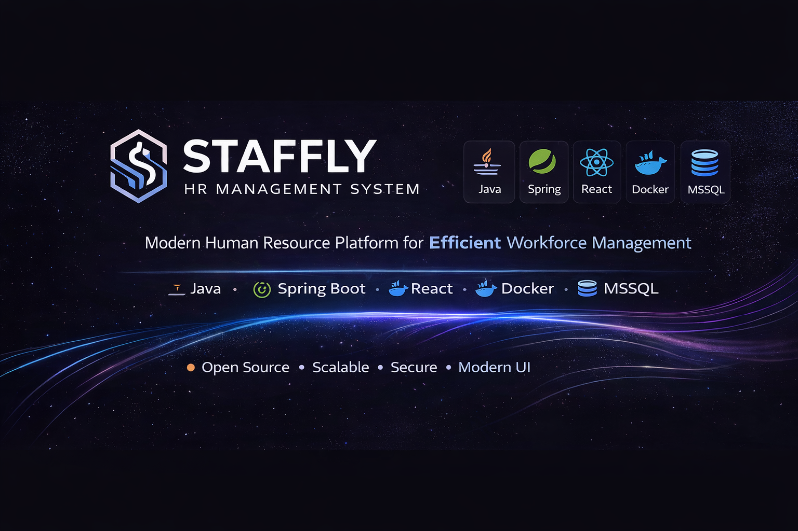
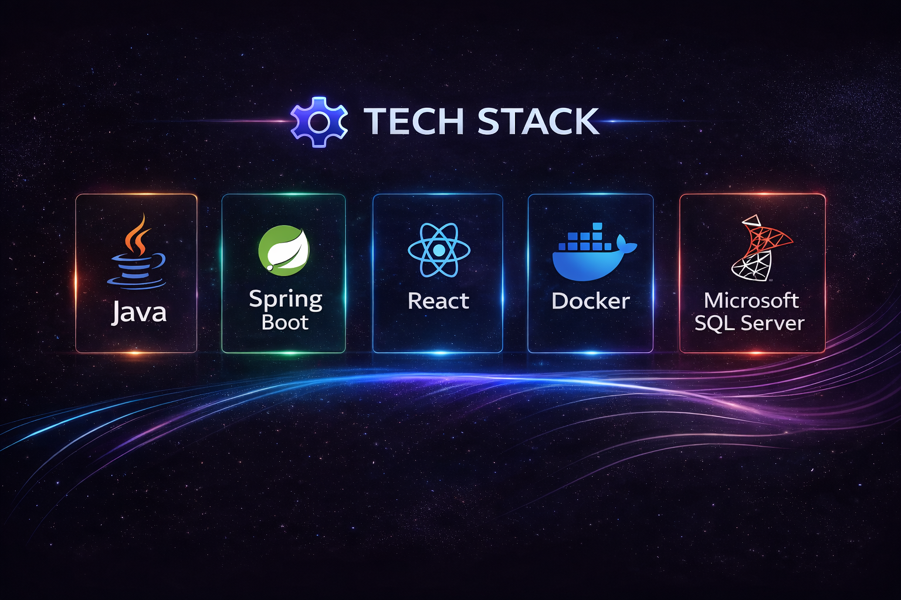
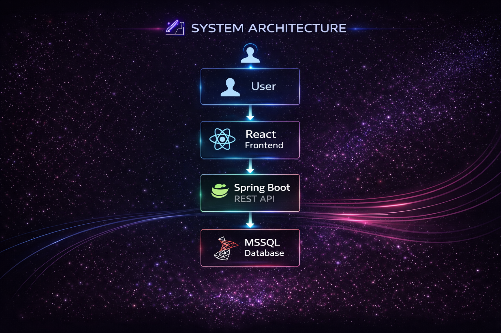
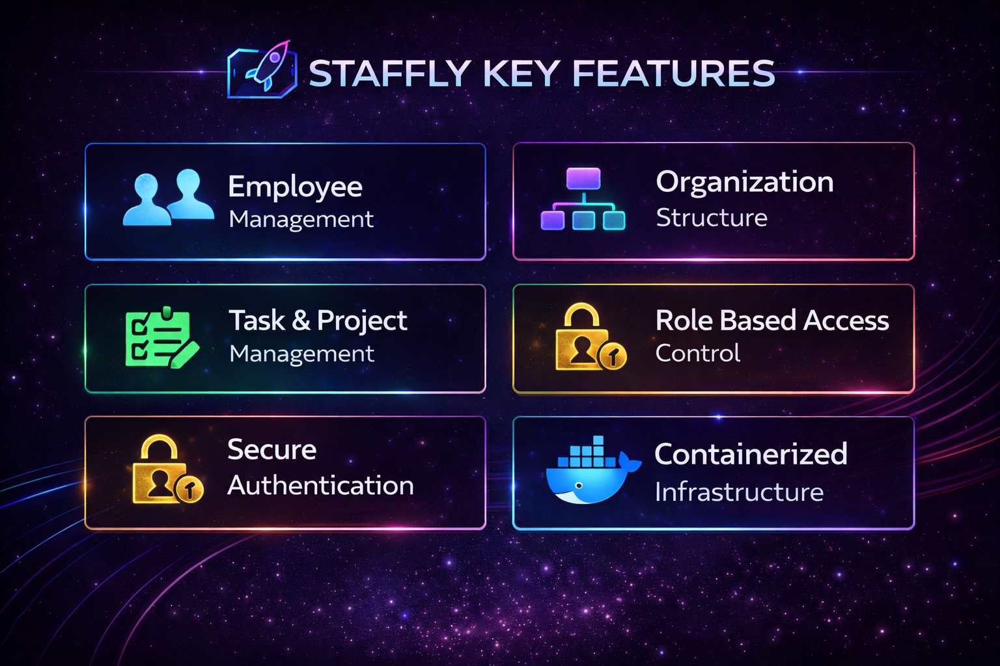
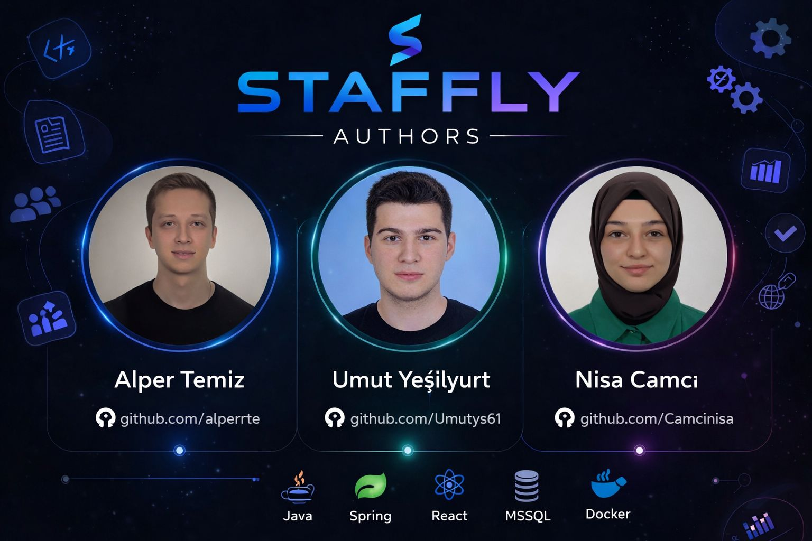
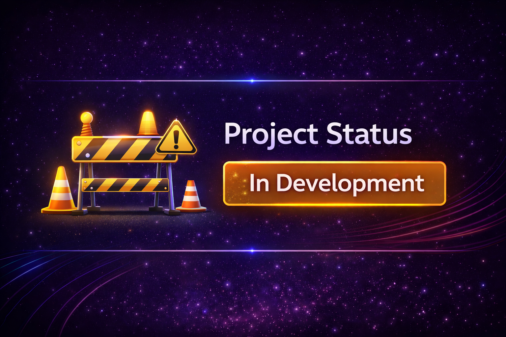

  

## 🚀 Staffly – Human Resource Management Platform

Staffly is a modern **Human Resource Management System (HRMS)** designed to streamline workforce operations.  
The platform provides comprehensive tools for managing employees, organizational structures, leave tracking, payroll processes and performance evaluation.

Built with a modern technology stack including **Spring Boot, React, Docker and Microsoft SQL Server**, Staffly focuses on scalability, security and maintainability.

## ⚙️ Tech Stack

## 🏗️ System Architecture

  

The Staffly system follows a modern three-tier architecture that separates the application into presentation, backend, and data layers.

• **React Frontend** handles the user interface and communicates with the backend using REST APIs.  
• **Spring Boot REST API** processes business logic, handles authentication, and manages application workflows.  
• **MSSQL Database** stores persistent data such as users, departments, tasks, and HR records.

This architecture ensures scalability, maintainability, and clear separation of responsibilities between system components.

## 🚀 Key Features

  

### 👥 Employee Management

Manage employee profiles within the organization.

- Employee profile management
- Department assignment
- Position and role management
- Centralized employee records

### 🏢 Organization Structure

Model the organizational hierarchy of the company.

- Organization hierarchy
- Department structure
- Position–title relationships
- Organizational mapping

### 📋 Task & Project Management

Manage tasks and projects across teams.

- Task assignment
- Project creation and tracking
- Task status management
- Team collaboration workflow

### 🔐 Role Based Access Control

Control system permissions through role-based authorization.

- Admin role management
- HR access permissions
- Employee access restrictions
- Secure role hierarchy

### 🔑 Secure Authentication

Secure login and authorization system.

- JWT based authentication
- Protected REST API endpoints
- Secure user session handling

### 🐳 Containerized Infrastructure

Modern container-based deployment architecture.

- Docker containerization
- Backend service container
- Database container
- Easy deployment and scalability

## ⚙️ Getting Started

Clone the repository

git clone https://github.com/alperrte/staffly.git

Navigate to project directory

cd staffly

## 🐳 Docker Setup

Build and start containers

docker-compose up --build

## 🔐 Environment Variables

Create a `.env` file in the root directory.

Example:

-DB_HOST=localhost
-DB_PORT=1433
-DB_USER=sa
-DB_PASSWORD=password

## 👨‍💻 Authors

  

🚧 Project Status: In Development

  

